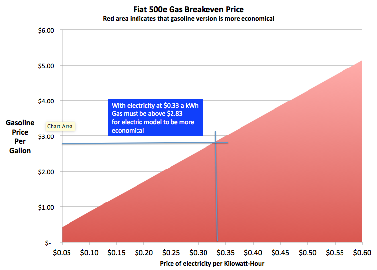

Title: EV or Gas, which is cheaper to run?
Slug: ev_or_gas
Date: 2015-03-01 10:39:00
Category: posts
Tags: EVs
author: Dane Collins
Summary: How to evaluate the operating cost of EVs

With the huge drop in gas prices over the last few months it has caused me to look at my electric Fiat 500e in a different light.  While I still love driving the car, I wondered if is it still more economical than the gas model?

I know that there are a lot of other operating costs than gasoline and electricity but the reality is that most people driving a Fiat these days are probably leasing them and in the first couple of years the only operating cost is fuel so that is my primary interest.

I did this analysis using the published MPG and MPGe statistics (as they say your mileage, and break-even points, may vary). Also, since electric cars are more commonly used for city driving I'm using the city MPG of the Fiat 500 for comparison.

Using the 31 MPG rating for the Fiat 500 and the 122 MPGe for the 500e we can look at the break-even point between the gas and electric model.

From this graph we can find the equivalent gasoline cost for any electricity cost.  For example, I pay $0.33 per Kilowatt-Hour in the SF Bay Area which produces a gasoline break-even price of $2.83. This means that if gasoline is below $2.83 it would be cheaper to operate the gas version of the Fiat 500.

Seeing gas at $2.63 last week shows that for a few weeks it was actually costing more to operate an electric 500e than a gas one.  I bet the dealers don't talk about that much!

Of course, probably no one purchases an electric car because of the operating costs and [sales of electric vehicles](http://www.hybridcars.com/january-2015-dashboard/) seems very strong despite the low price of gas.