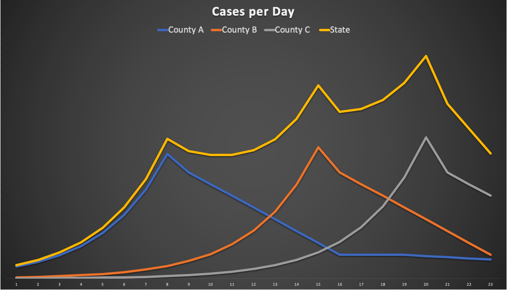

Title: About Covid-19 Data, Part 1
Slug: covid1
Date: 2020-05-09 20:00
Category: posts
Tags: covid, data
author: Dane Collins
Summary: Covid data with the context to understand it

# Biases

Every time you see a chart remember that a chart is an __argument made visual__.
The person that created the chart had a point they wanted to make and
they believed that data would convince you.  That point might have been from an objective point of view, or might have been created
to promote a specific agenda. It is always worth approaching a data-based
argument with a bit of skepticism.

Given that, let me state my bias. I want things to reopen.  I hate not being able to go to
a restaurant or a bar. I believe that shutting everything down when we knew nothing was the right,
although painful, thing to do but, as long as we stay shutdown we learn nothing.  Only by trying things, seeing what works and what does not can we learn enough to manage our way through this.

# About Data

Data does not tell us what to do. It can inform us but, our own beliefs will color what we think the
right thing to do is.  Here is an example of what I mean.

We know that the shelter-in-place reduces the spread of Covid19.  It also keeps people with heart problems out of the hospital and places homeless people at increased risk. How do you balance those
groups?  There is no mathematics that allows you to balance that.  It will always be a judgment call.

# Covid is a local issue

First and foremost, this is a local issue.  Santa Clara is not Santa Cruz, it's not LA, it's not 
Fresno.  If you want to understand Covid-19, start at the local level where you can understand it
best.  The problem with trying to look at the big picture is that adding a bunch of data together
actually makes it less clear, not more clear.  Here is an example of what I mean.  Let's look at
a fictional state that has 3 counties.  Here we are plotting the daily number of cases in each county
and then the number of cases at the state level.

When we look at the state cases on this chart, which looks a lot like the California case curve, 
our first thoughts could be that everytime it looks like cases are going down, people stop being
good and cases go back up.  But, when we look at the county level, we get a much better insight
into what is going on.  What we actually have is three counties going through the exact same
type of epidemic but each at a different time.  Each county is getting over it at the same rate
but since they started at a different time, they will recover at different times.  When you add 
them up though, rather than seeing a staged recovery you see a spiked increase in cases.

# How is Santa Clara doing?

The best data for Santa Clara is the [county webpage](https://www.sccgov.org/sites/covid19/Pages/dashboard.aspx)

There is a lot of data there. For me, the most interesting graph at the site is the "New Cases by
Specimen Collection Date". When I look at this I see that during March, cases were increasing but
that in the last several weeks, the cases per day are slowly dropping.

Note: when looking at any Covid-19 graphs it is good to remember:

* data collection is uneven, it's often terrible on the weekend, there are catch-up days, etc.
* trends are good, the day-by-day number are not
* often, sources are going back and changing old data
* always make sure you know if a chart is cumulative or incremental. Cumulative charts can only go up, never down.
