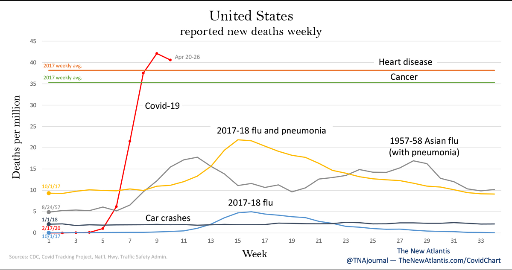

Title: About Covid-19 Data, Part 2
Slug: covid2
Date: 2020-05-10 20:00
Category: posts
Tags: covid, data
author: Dane Collins
Summary: Covid data with the context to understand it

# Is this really worse than other flu years

A typical flu year will cause 23,000-60,000 deaths, as [estimated by the CDC](https://www.washingtonpost.com/business/2020/05/02/theres-more-accurate-way-compare-coronavirus-deaths-flu/).  That does not mean that Covid19 is just another flu.
We need to remember that we have managed
to keep Covid19 deaths at 70,000 **only because of the shelter-in-place**.  Had we not done that and treated
this as a regular flu year we could expect all states to look like New York.  Many states, by taking action,
prevented this scenario.  Because it was prevented, we don't know what it would have looked like, only that it would be worse.

# Things to watch for

Whether listening to people's arguments, looking at their graphs, reading their stories it helps to
know some of the telltale signs of people misusing data. Sometimes this misuse is on purpose but way
more often, people are just forgetting some basic principles. Here are some basic things to watch for.

### Data extrapolation

This argument goes like "I tested 100 people and 2 were sick so 2% of all people are sick". This will
only be true if the people you tested are a completely random sample. When it comes to testing people
for Covid19 the testing is never random so you can never extrapolate the results to everyone.

### Time scale matters

I see people making arguments by conveniently selecting the time scale.
This argument goes "50,000 people die of car accidents and 50,000 people have died from Covid19
so it is no worse than car accidents".  What if we instead change this to per month instead of per year?
That would change the statement to "35,000 people died from Covid this month but 4,200 people died in car accidents".  What if
we used a 10 year scale?  Then we have "500,000 people died in car accidents and 50,000 from Covid19".  The time
scale completely changes the message.  You have to make sure the timescale being used were not selected to mislead you.

This comes up frequently in discussing comparing Covid19 deaths
to other causes.  The best argument I've seen is presented in this chart

[from this article in The New Atlantis](https://www.thenewatlantis.com/publications/not-like-the-flu-not-like-car-crashes-not-like).
While we can see here is how quickly Covid-19 deaths has increased, the real story is in what happens in the future.  Will the curve
stay high with continued increase in deaths or will it fall off quickly.  This is one of the things that makes it so hard to 
predictions about the epidemic.
