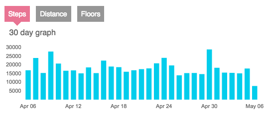
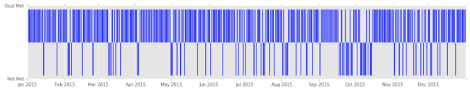
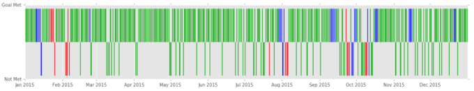
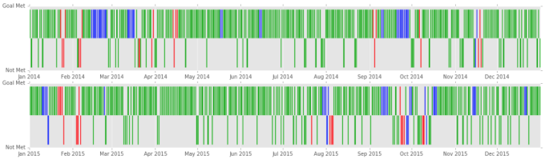

Title: Did I Meet My Goal
Date: 2016-05-06
Category: posts
Tags: Fitbit, Fitness
author: Dane Collins
Summary: How to look at daily data over long periods of time.

Like many people that have fitness trackers, I set a daily goal. It's great to look at the end of the day and see if I have met my goal but when I want to look back at a month, or a year, to see how well I'm doing it is pretty hard to do.

I can go to the fitbit.com site and look at a month of data and see

but it is hard to see which days I did not meet my goal from this. If I want to look at a whole year, all I can do is look at monthly totals which is not very useful.

I knew I needed a pretty compact format if I wanted to see a whole year at a time. Something like a scatter plot.  Then I remembered a chart I had see at a Tufte course and knew what I wanted.  By converting my days from steps to either "goal met" or "goal not met" I could simplify the presentation.  Using a skinny bar chart I arrived at this.

This allows me to see a full year with the strokes going up being days that I met my goal and strokes going down being the days that I missed my goal. This make it clear that I'm missing my goal way too often but also that the days I miss my goal are not as isolated as I hoped with some long streaks.

Another benefit of this representation is that I have one more dimension to play with: color. I speculated that my out-of-town travel was a reason I was missing my goal. By using red as the color when I'm on work travel, blue for vacation travel and green for when I'm home I could turn the image into this.

Here I can see that when I'm on vacation I still do pretty well but there are a lot of those goal misses on work travel days.

Another perk of this format is that it is easy to stack these up to show multiple year at once. Here is 2 full years of data.

I've found this presentation useful. I can now imagine using color to represent which days I went cycling or days when it rained. Lots of options.

Let me know if you have found a good way to visually represent step data.

